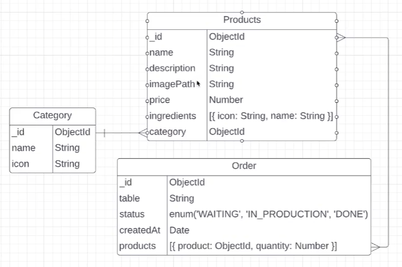

# WaiterApp

## Comandos:

`yarn build` -> Gerará um build dos arquivos.
`yarn dev` -> Iniciará o projeto na porta 3001.
`yarn start` -> Iniciará o projeto na porta 3001 com os arquivos buildados.

## Diagrama WaiterApp

